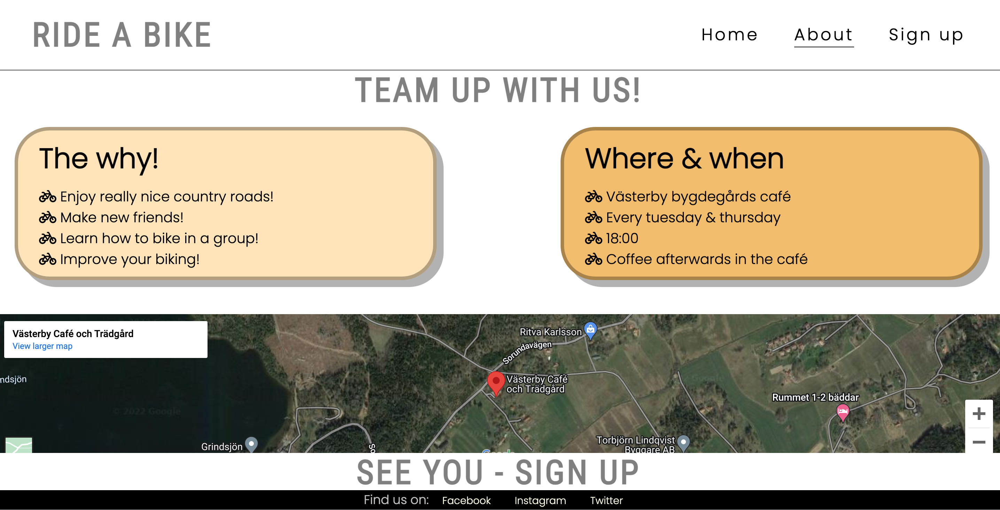
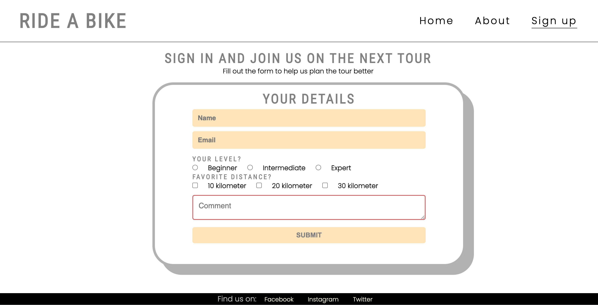
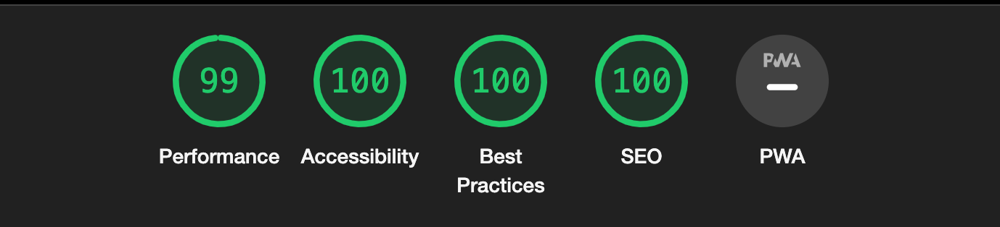

# Ride A Bike

Ride A Bike is a site that hopes to help keep people motivated to meet up for cycle training in Norra Sorunda, south of Stockholm. The site will be targeted toward cyclist who are looking for a way to socialise, enjoy new routes and train recreational bike rides in a group.

# Features

## Existing Features

### Navigation Bar

- Featured on all three pages, the full responsive navigation bar includes links to the Logo, Home page, About and Sign up page and is identical in each page to allow for easy navigation.
- This section will allow the user to easily navigate from page to page across all devices without having to revert back to the previous page via the ‘back’ button.

### The landing page image

The landing includes a photograph with text overlay to allow the user to see exactly which location this site would be applicable to.

### The about page

The about page gives information about ability to bicycle train in a group and where and when the training starts. 

### The sign up page

Here you can add name and email address to join a group training session and information on what level you are and which distances you prefer.

## Features left to implement
- Blog on race biking in general and more specific show the different routes.
- A menu from the Café 

# Testing
Test is done manual on different divices with different screens sizes.

# Validator Testing

### HTML
No errors were returned when passing through the official W3C validator
### CSS
No errors were found when passing through the official (Jigsaw) validator
### Accessibility
The Lighthouse test tool show good result in accesibility

# Deployment
The site was deployed to GitHub pages. The steps to deploy are as follows:
In the GitHub repository, navigate to the Settings tab
From the source section drop-down menu, select the Master Branch
Once the master branch has been selected, the page will be automatically refreshed with a detailed ribbon display to indicate the successful deployment.
The live link can be found here - https://samskod.github.io/ride-a-bike/index.html

# Credits
Example code and design is used from:
- Code Institute Love Running project
- Code Institute Coders Coffeeshop example
- Free frontend https://freefrontend.com

# Content
The icons in the lists were taken from Font Awesome

# Media
Background image was taken from Pexel.