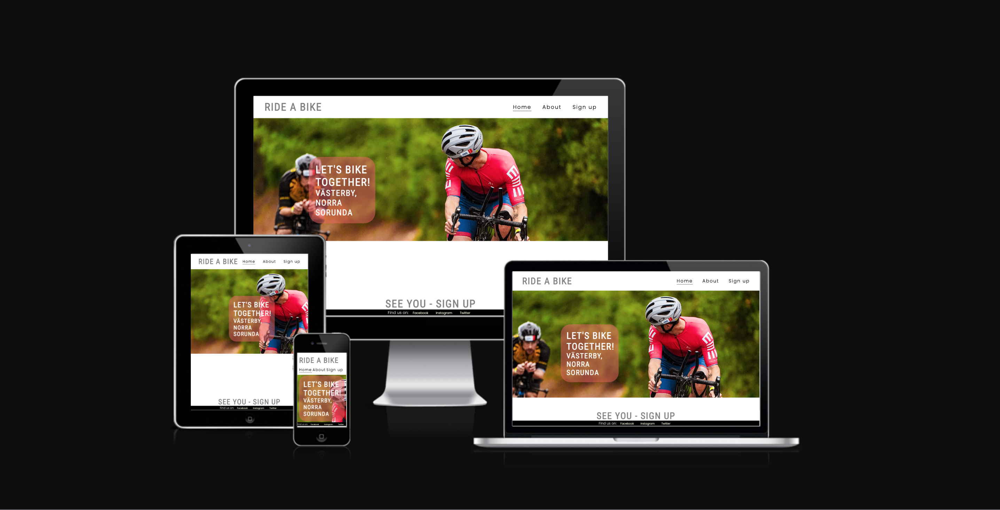

# Ride a bike

# Features

## Existing Features

# Testing

# Validator Testing
### HTML
No errors were returned when passing through the official W3C validator
### CSS
No errors were found when passing through the official (Jigsaw) validator

# Deployment
The site was deployed to GitHub pages. The steps to deploy are as follows:
In the GitHub repository, navigate to the Settings tab
From the source section drop-down menu, select the Master Branch
Once the master branch has been selected, the page will be automatically refreshed with a detailed ribbon display to indicate the successful deployment.
The live link can be found here - https://samskod.github.io/ride-a-bike/index.html

# Credits

# Content
The icons in the footer were taken from Font Awesome

# Media
Background image was taken from Pexel.